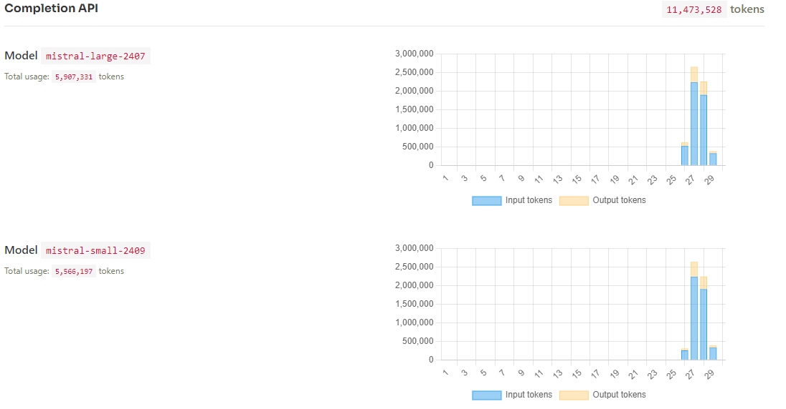
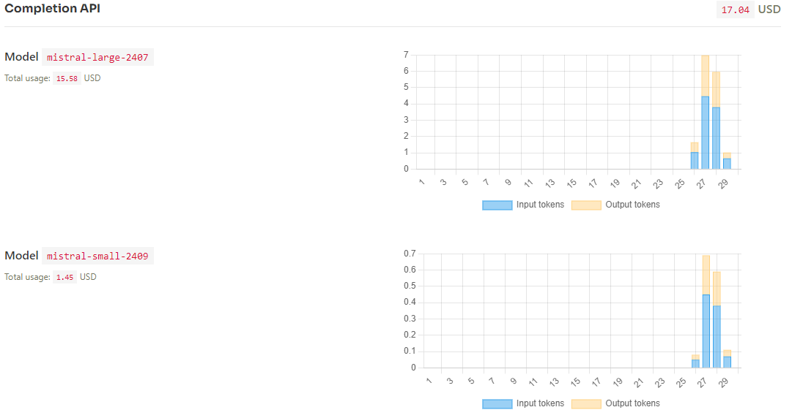

```{r setup, include=FALSE}
knitr::opts_chunk$set(echo = TRUE)
```

# Preface {-}

In this project, we utilize the open-source `r fontawesome::fa(name = "r-project", fill = "steelblue")` programming language, alongside Python, to evaluate the consistency of large language models (LLMs) through intra- and inter-reliability methods. For R, we are using *version 4.4.1 (2024-06-14 ucrt)*, and we manage package dependencies with `renv`. The `renv` package allows for isolated project environments, ensuring the same versions of R packages are used consistently. If you're new to `renv`, it enables the creation of "snapshots" for package versions, ensuring reproducibility across different systems. You can find all package versions used in this project in our `renv` repository at [this link](https://github.com/fmegahed/ai_msa/tree/main/renv).

This document is structured using RMarkdown, which seamlessly integrates both R and Python code chunks. Readers can tell the difference between R and Python code chunks by downloading the raw RMarkdown file from [this repository](https://github.com/fmegahed/ai_msa/tree/main/markdowns). In addition, the document features a **floating table of contents (TOC)** on the side, which makes navigation through the sections more convenient. The TOC follows the reader as they scroll, allowing quick access to different sections.

We’ve also implemented **foldable code chunks**, enabling the user to expand and collapse code as needed to focus on the explanations or results. This feature improves the document’s readability by allowing you to hide the code while reading the main content. If you would like to view or modify the raw code, click the "Code" button at the top of the document to download the full RMarkdown file. This gives you access to all the code chunks used in the analysis.

For the Python sections, we are using a conda environment with *Python version 3.12.5*. The required Python packages can be installed via the `requirements.txt` file, available [here](https://github.com/fmegahed/ai_msa/blob/main/requirements.txt). The RMarkdown document links to the conda environment, allowing Python chunks to execute alongside the R code in the same workflow.

To securely store API secrets for the large language models (LLMs) accessed in the Python chunks, we use a `.env` file that holds these keys in a safe, environment-specific manner. Similarly, for the stock news API accessed in the R sections, we save the API secret in a project-based `.Renviron` file. Both files keep sensitive credentials secure and allow us to avoid hardcoding API secrets directly in the code. For obvious security reasons, we did not push these `.env` and `.Renviron` files to our GitHub repository.

All input and output files for this project can be accessed and downloaded from our [GitHub repository](https://github.com/fmegahed/ai_msa).


# Objectives of this Analysis

- We present minimum sample size calculations for the binary and multiclass classification experiments.  
- We describe the experimental setup for the consistency analysis of multiple LLMs.  
- We provide a custom function for LLM classification experiments.  
- We present an example of a binary classification experiment, using the LLMs to label the sentiment of news articles related to the stock market, and utilize the intra- and inter-rater reliability methods to evaluate the consistency of the LLMs.
- We present an example of a multiclass classification experiment, using the LLMs to label the impact of AI on jobs and tasks, and utilize the intra- and inter-rater reliability methods to evaluate the consistency of the LLMs.


# Sample Size Calculations for the Different Experiments

The minimum sample size for each of our experiments was computed for: **simple percent agreement**, **Gwet's AC1 coefficient**, and **Brennan-Prediger coefficient**. The minimum sample size was computed using the tables in [Handbook of Inter-Rater Reliability, 5th Edition. Volume 1: Analysis of Categorical Ratings](https://sites.fastspring.com/agreestat/instant/cac5ed978_1_7923_5463_2e). The sample sizes were computed for the three different metrics, with a margin of error of 0.05, a confidence level of 0.90, and for five replicates.


## Minimum Sample Size for the Binary Classification Experiment

```{r binary_classification_sample_size, echo=FALSE, results='asis'}
# create a data frame of the obtained sample size results
binary_data = data.frame(
  metric = c("Percent Agreement", "Gwet’s AC1 Coefficient", "Brennan-Prediger Coefficient"),
  `sample size` = c(216, 1317, 847) |> scales::comma()
)

# generate the table in HTML format
knitr::kable(
  binary_data, format = "html", table.attr = "style='width:50%;'", 
  align = c('l','r')
  ) |>
  kableExtra::kable_styling(full_width = FALSE) |>
  kableExtra::column_spec(1, bold = TRUE)
```

Therefore, using the highest sample size among the three metrics, we need at **least 1,317 samples** for the binary classification experiment.


## Minimum Sample Size for the Multiclass Classification Experiment

To estimate the sample size needed by [Eisfeldt et al. 2023](https://www.nber.org/system/files/working_papers/w31222/w31222.pdf) in their 4-class classification experiment, we used a similar approach to the binary classification experiment. The minimum sample size was computed for the three different metrics, with a margin of error of 0.05, a confidence level of 0.90, and for five replicates.

```{r multiclass_classification_sample_size, echo=FALSE, results='asis'}
# create a data frame of the obtained sample size results
multiclass_data = data.frame(
  metric = c("Percent Agreement", "Gwet’s AC1 Coefficient", "Brennan-Prediger Coefficient"),
  `sample size` = c(474, 988, 912) |> scales::comma()
)

# generate the table in HTML format
knitr::kable(
  multiclass_data, format = "html", table.attr = "style='width:50%;'",
  align = c('l','r')
  ) |>
  kableExtra::kable_styling(full_width = FALSE) |>
  kableExtra::column_spec(1, bold = TRUE)
```

Therefore, using the highest sample size among the three metrics, we need at **least 988 samples** for the multiclass classification experiment.


# Experimental Setup for the Consistency Analysis


## LLMs Used and their API Keys

In our experiments, we selected the following LLMs:

- `claude-3-5-sonnet-20240620`, which is [Anthropic's current best model](https://www.anthropic.com/news/claude-3-5-sonnet) as of Sept 24, 2024;
- `command-r-plus`, which is [Cohere's latest model](https://docs.cohere.com/docs/command-r-plus) as of Sept 24, 2024;
- `mistral-small-2409`, which is the latest small model from [Mistral](https://www.mistral.ai/) as of Sept 24, 2024, 
- `gpt-4o-2024-08-06`, which is [OpenAI's flagship, stable, model](https://platform.openai.com/docs/models/gpt-4o) as of Sept 24, 2024;   
-`claude-3-haiku-20240307`, which represents the smallest model provided by [Anthropic](https://docs.anthropic.com/en/docs/about-claude/models#model-names) as of Sept 24, 2024;
- `mistral-large-2407`, which is the latest large model from [Mistral](https://www.mistral.ai/) as of Sept 24, 2024; and 
- `gpt-4o-mini`, which is [OpenAI's latest stable and mini model](https://platform.openai.com/docs/models/gpt-4o-mini). 


```{python models}
# load the necessary libraries
from dotenv import load_dotenv
from langchain.prompts.chat import ChatPromptTemplate

# load the environment variables
load_dotenv()

# the API keys for the different LLMs
openai_api_key = os.getenv('OPENAI_API_KEY')
anthropic_api_key = os.getenv('ANTHROPIC_API_KEY')
cohere_api_key = os.getenv('COHERE_API_KEY')
groq_api_key = os.getenv('GROQ_API_KEY')
mistral_api_key = os.getenv('MISTRAL_API_KEY')

# the LLM models to be used for labeling
models = [
  'claude-3-5-sonnet-20240620',
  'command-r-plus',
  'mistral-small-2409',
  'gpt-4o-2024-08-06',
  'claude-3-haiku-20240307',
  'mistral-large-2407',
  'gpt-4o-mini'
]
```


## A Custom Function for LLM Calls

We created a custom function, `generalized_chat_completion`, to facilitate the interaction with the LLMs and generate chat completions for each news article in the dataset. The function takes the following parameters: 

- `csv_path`: the path to the CSV file containing the news articles;
- `columns_to_keep`: the columns to retain in the final CSV output;
- `models`: a list of chat models to be used;
- `chat_prompt_template`: the prompt template for generating chat messages;
- `columns_for_chat_prompt`: the columns to be used as the user input in the chat prompt template;
- `num_replicates`: the number of replicates per model;
- `temp`: the temperature for the chat model;
- `max_num_tokens`: the maximum number of tokens for chat completions;
- `save_to_csv`: whether to save results to CSV;
- `output_file`: the path to the output CSV file; and 
- `retry_attempts`: the number of retry attempts for API errors.

The function reads the CSV file, replicates the data based on the number of models and replicates, sorts the data frame, and iterates through each row to generate chat completions. It uses the specified chat model to generate chat responses, with error handling for API errors. The function saves the results to a CSV file if required and returns the last chat response content if `save_to_csv` is `False`.

```{python custom_fun}
import pandas as pd
import datetime as dt
import os
import time
from langchain_openai import ChatOpenAI
from langchain_anthropic import ChatAnthropic
from langchain_cohere import ChatCohere
from langchain_mistralai import ChatMistralAI
from langchain_groq import ChatGroq

def generalized_chat_completion(
    csv_path,
    columns_to_keep,
    models,
    chat_prompt_template,
    columns_for_chat_prompt,
    num_replicates,
    temp=0,
    max_num_tokens=3000,
    save_to_csv=True,
    output_file='../results/generalized_classification.csv',
    retry_attempts=3
):
    """
    Generalized function to generate chat completions from a CSV file, with flexible parameters
    for various chat models, sorting order, and error handling.
    
    Parameters:
        csv_path (str): Path to the CSV file to read data from.
        columns_to_keep (list): Columns to retain in the final CSV output.
        models (list): List of chat models to be used.
        chat_prompt_template (str): The prompt template for generating chat messages.
        columns_for_chat_prompt (list): Columns to be used as the user input in the chat prompt template.
        num_replicates (int): Number of replicates per model.
        temp (float): Temperature for the chat model.
        max_num_tokens (int): Maximum number of tokens for chat completions.
        save_to_csv (bool): Whether to save results to CSV.
        output_file (str): Path to the output CSV file.
        retry_attempts (int): Number of retry attempts for API errors.
    
    Returns:
        None or the last chat response content if save_to_csv is False.
    """
    # read the CSV file
    df = pd.read_csv(csv_path)
    num_rows = df.shape[0]
    total_repeats = len(models) * num_replicates

    # add an index column as 'article_num'
    df['article_num'] = df.index

    # replicate the dataframe based on the total repeats
    expanded_df = pd.concat([df] * total_repeats, ignore_index=True)

    # generate model and replicate columns
    model_column = [model for model in models for _ in range(num_replicates * num_rows)]
    replicate_column = [i + 1 for _ in range(len(models)) for i in range(num_replicates) for _ in range(num_rows)]

    # add the model and replicate columns to the dataframe
    expanded_df['replicate'] = replicate_column
    expanded_df['chat_model'] = model_column

    # sort the dataframe by 'article_num' and 'replicate'
    expanded_df = expanded_df.sort_values(by=['article_num', 'replicate']).reset_index(drop=True)

    # iterate through each row and generate chat completions
    for index in range(expanded_df.shape[0]):
        prompt_data = {col: expanded_df.loc[index, col] for col in columns_for_chat_prompt}
        messages = chat_prompt_template.format_messages(**prompt_data)

        # extract model name and assign the correct chat model
        model = expanded_df.loc[index, 'chat_model']
        chat_model = None
        if model == 'gpt-4o-2024-08-06':
            chat_model = ChatOpenAI(model="gpt-4o-2024-08-06", temperature=temp, max_tokens=max_num_tokens)
        elif model == 'gpt-4o-mini':
            chat_model = ChatOpenAI(model="gpt-4o-mini", temperature=temp, max_tokens=max_num_tokens)
        elif model == "claude-3-5-sonnet-20240620":
            chat_model = ChatAnthropic(model="claude-3-5-sonnet-20240620", temperature=temp, max_tokens=max_num_tokens)
        elif model == "command-r-plus":
            chat_model = ChatCohere(model="command-r-plus", temperature=temp, max_tokens=max_num_tokens)
        elif model == "mistral-large-2407":
            chat_model = ChatMistralAI(model="mistral-large-2407", temperature=temp, max_tokens=max_num_tokens)
        elif model == "claude-3-haiku-20240307":
            chat_model = ChatAnthropic(model="claude-3-haiku-20240307", temperature=temp, max_tokens=max_num_tokens)
        elif model == "mistral-small-2409":
            chat_model = ChatMistralAI(model="mistral-small-2409", temperature=temp, max_tokens=max_num_tokens)
        else:
            print(f"Model {model} is not supported. Skipping this row.")
            continue

        # attempt to generate chat response with retries for error handling
        chat_response_content = "--"
        chat_response_id = None
        for attempt in range(retry_attempts):
            try:
                chat_response = chat_model.invoke(messages)
                chat_response_content = chat_response.content
                chat_response_id = chat_response.id
                break
            except Exception as e:
                error_message = str(e)
                if attempt == retry_attempts - 1:
                    print(f"Failed after {retry_attempts} attempts for model {model} on index {index}. Error: {error_message}")
                else:
                    print(f"Attempt {attempt + 1} failed for model {model} on index {index}. Retrying in 30 seconds...")
                    time.sleep(30)

        # create the row with the desired columns
        data_row = pd.DataFrame({
            **{col: [expanded_df.loc[index, col]] for col in columns_to_keep},
            'chat_model': [model],
            'chat_date': [dt.datetime.now().strftime('%Y-%m-%d %H:%M:%S')],
            'chat_replicate': [expanded_df.loc[index, 'replicate']],
            'chat_response': [chat_response_content],
            'chat_response_id': [chat_response_id]
        })

        # save to CSV if required
        if not save_to_csv:
            continue
        elif not os.path.exists(output_file):
            data_row.to_csv(output_file, index=False)
        else:
            existing_df = pd.read_csv(output_file)
            updated_df = pd.concat([existing_df, data_row], ignore_index=True)
            updated_df.to_csv(output_file, index=False)
    
    if not save_to_csv:
        return chat_response_content

```


## A Custom Function for Extracting the LLM Labels

We created a custom function, `extract_classification`, to extract the classification labels from the chat completions generated by the LLMs. The function takes the chat response content and a list of valid words as input. It extracts the classification label from the chat response content based on the valid words provided. The function returns the extracted classification label if it matches any of the valid words; otherwise, it returns `NA`.

```{r custom_extract_labels}
extract_classification = function(text, valid_words) {
  
  # helper function to drop rows with unwanted words
  drop_row = function(row) { 
    all(is.na(row) | row == "classification.\n\ntemp")
  }
  
  # preprocess the text
  text = stringr::str_replace(text, "\\n<classification>", "\ntemp<classification>")
  text = stringr::str_replace(text, "The classification is", "<classification>:")
  text = stringr::str_replace_all(text, c(
    "Slightly" = "", # Remove the word "slightly"
    "clearly" = "",      # Remove the word "clearly"
    '\\"' = "",          # Remove escaped quotes (\\")
    '"' = ""             # Remove regular quotes (")
  ))
  
  # define a regex pattern to match:
  # 1. "\n\nclassification" with or without special characters or colons after it
  # 2. "\n\n<classification>:" or "\n\n<classification>word</classification>"
  matches = stringr::str_match_all(text, "(?i)(classification[^a-zA-Z]*:?\\s*\\w+|<classification>(\\w+)</classification>)")

  # get the last match if it exists
  if (length(matches[[1]]) > 0) {
    if (nrow(matches[[1]]) > 1) {  
      # Apply the function to filter out unwanted rows
      matches[[1]] = matches[[1]][!apply(matches[[1]], 1, drop_row), , drop = FALSE]
    }
    first_match = head(matches[[1]], 1)
    last_match = tail(matches[[1]], 1)
    word = NA
    word1 = NA
    word2 = NA
    # Handle the case for "<classification>word</classification>"
    if (!is.na(first_match[, 3])) {
      word = first_match[, 3]  # Extract word between <classification> and </classification>
    }else if (!is.na(last_match[, 3])) {
      word = last_match[, 3]
    }else {
      word1 = stringr::str_extract(first_match[, 1], "\\w+$")  # Otherwise, extract word after "classification"
      word2 = stringr::str_extract(last_match[, 1], "\\w+$")
    }
    
    # Check if the extracted word is in the valid_words list
    if (tolower(word) %in% tolower(valid_words)) {
      return(word)
    } else if (tolower(word1) %in% tolower(valid_words)){
      return(word1)
    } else if (tolower(word2) %in% tolower(valid_words)){
      return(word2)
    } else {
      return(NA)  # Return NA if the word is not in valid_words
    }
  } else {
    return(NA)  # Return NA if no match is found
  }
}

```

## Custom Functions for Computing the Reliability Metrics

```{r compute_reliability_metrics}
# Function to get summary statistics for mean percent agreement
pa_summary = function(df, digits=4){
  llm_models = unique(df$chat_model)
  df_summary = data.frame(model = llm_models, mPa = rep(NA, length(llm_models)))
  
  for (i in 1:length(llm_models)){
    m1 = df |> dplyr::filter(chat_model == llm_models[i])
    df_summary[i,2] = paste0(
      round(mean(m1$percent_agreement/100), digits), " (", 
      round(sd(m1$percent_agreement/100), digits),   ")"
      )
  }
  return(df_summary)
}

# function to compute the other reliability metrics
# should contain one variable called chat_model,
# and vars indicates variables for raters
reliability_coefs = function(df, vars){
  
  df_coefs = data.frame(matrix(NA, ncol=9, nrow=42))
  
  colnames(df_coefs) = c("model", "coeff.name", "pa", "pe", "coeff.val", "coeff.se", "conf.int", "p.value", "w.name")
  
  llm_models = unique(df$chat_model)
  
  df_coefs$model = rep(llm_models, each=6)
  
  if (is.integer(vars)) vars = colnames(df)[vars]
  
  df_rates = df |>
    dplyr::select(dplyr::all_of(c("chat_model", vars)))
  
  for (i in c(1, 7, 13, 19, 25, 31, 37)){
    m1 = df_rates |>
      dplyr::filter(chat_model == llm_models[ceiling(i/6)]) |>
      dplyr::select(-chat_model)
    
    df_coefs[i,-1] = irrCAC::conger.kappa.raw(m1)$est
    df_coefs[(i+1),-1] = irrCAC::fleiss.kappa.raw(m1)$est
    df_coefs[(i+2),-1] = irrCAC::pa.coeff.raw(m1)$est
    df_coefs[(i+3),-1] = irrCAC::gwet.ac1.raw(m1)$est
    df_coefs[(i+4),-1] = irrCAC::bp.coeff.raw(m1)$est
    df_coefs[(i+5),-1] = irrCAC::krippen.alpha.raw(m1)$est
    
  }
  
  return(df_coefs)
  
}


```


## Custom Functions to Compute Agreement with Gold Standard

In the chunk below, we present two functions:  

- `calculate_agreement`: This function calculates the agreement between the replicates and the gold standard. It takes the replicates and the gold standard as input and returns the agreement percentage. The function also has an optional parameter `na` to handle missing values. If `na = 0`, the function will not consider missing values in the calculation.  

- `ensemble_reps`: This function ensembles the replicates by selecting the most common value. It takes the replicates as input and returns the most common value. The function also has an optional parameter `na` to handle missing values. If `na = 0`, the function will not consider missing values in the calculation. In case of ties, the function randomly selects one of the most common values.

```{r compute_agreement_with_gold_standard}
calculate_agreement = function(reps, ground_truth, na = 0) {
  na_rm = dplyr::if_else(na == 0, T, F, missing = F)
  
  matches = sum(reps == ground_truth, na.rm = na_rm)
  total_reps = length(reps)
  agreement = matches / total_reps
  
  return(agreement)
}

# ensemble function to ensemble the replicates
ensemble_reps = function(reps, na = 0){
  
  # handling of NAs
  na_rm = dplyr::if_else(na == 0, "no", "ifany", missing = "ifany")
  
  # get the most common value
  freq_table = table(reps)
  max_freq = max(freq_table)
  most_common_values = names(freq_table)[freq_table == max_freq]
  
  # randomly select one of the most common values
  most_common = sample(most_common_values, 1)
  
  return(most_common)

}

```


# The Binary Classification Experiment

## Extracting the Full Dataset

We use the [stocknewsapi](https://stocknewsapi.com/) to extract articles related to the stock market. We crafted our request to get all tickers from May 1, 2024 to September 23, 2024. The data was pulled on September 24, 2024 at 23:04 EDT. The resulting data frame was saved as a RDS file. To run the code below, you need to set the `stock_token` environment variable to your API token. In our case, we saved the token as an environment variable using the `usethis::edit_r_environ(scope = 'project')` function.

```{r extract_stock_data, cache=TRUE, results='asis'}
# pull the stock_api_token from the environment variable
stock_api_token = Sys.getenv("stock_token")

# crafting the request for the API
request = paste0(
  "https://stocknewsapi.com/api/v1/category?", # The base URL for the API
  "section=alltickers", # We are interested in all tickers
  "&sentiment=positive,negative", # We want non neutral sentiments
  "&type=article", # We are interested in articles
  "&items=100", # We want 100 items per page
  "&date=05012024-09232024", # The date range
  "&token=", stock_api_token, # The API token (ours is saved as an ENV Variable)
  "&page=") # the pages that we will iterate over

# crafting all requests
all_requests = paste0(request, 1:100)

# pulling the data from the API and cleaning the data prior to saving it
stock_news_df = purrr::map_df(all_requests, ~jsonlite::fromJSON(.x)$data) |> 
  # convert the topics and tickers cols into chr (they are lists of strings)
  dplyr::mutate(tickers = purrr::map_chr(tickers, ~ paste(.x, collapse = ", "))) |> 
  dplyr::mutate(topics = purrr::map_chr(topics, ~ paste(.x, collapse = ", "))) |> 
  # convert the date column from character to datetime
  dplyr::mutate(date = lubridate::dmy_hms(date, tz = "America/New_York"))

# writing the data frame as RDS and CSV files
readr::write_rds(stock_news_df, "../data/stock_news_data.rds")
readr::write_csv(stock_news_df, "../data/stock_news_data.csv")
```

```{r get_column_names, include=FALSE}
# This code chunk is used to get the column names of the stock_news_df data frame
# it will be used to print the column names nicely in the text below
# we do not want to show the code chunk in the final document and hence 
# we set include=FALSE

# Get column names
column_names = names(stock_news_df)

# Create a string with all column names except the last one
all_but_last = paste(column_names[-length(column_names)], collapse = ", ")

# Add the last column name with ", and " before it
final_string = stringr::str_c(all_but_last, ", and ", column_names[length(column_names)])
```

The CSV file containing the stock news data can be accessed [here](https://github.com/fmegahed/ai_msa/blob/main/data/stock_news_data.csv). The `stock_news_df` data frame contains `r scales::comma(nrow(stock_news_df))` rows and `r ncol(stock_news_df)` columns. The names of the columns are: `r final_string`. Furthermore, the sentiment of the articles is stored in the `sentiment` column. The sentiment of those articles is divided into two categories: `positive`, and `negative`. Their distribution is as follows:

```{r sentiment_table, echo=FALSE, results='asis'}
pander::pander(table(stock_news_df$sentiment), compact = TRUE)
```

## Downsampling the Binary Classification Dataset

In this subsection, we filtered out rows with multiple `tickers` in the tickers column, keeping only rows with a single ticker (to ensure data quality). Additionally, we ensured the uniqueness of tickers during downsampling by selecting distinct tickers. 

```{r downsample_binary_classification, results='asis'}
set.seed(2024) # set the seed for reproducibility

binary_data = stock_news_df |>
  dplyr::filter(!stringr::str_detect(tickers, ",")) |> # keep rows without commas (i.e., single tickers)
  dplyr::group_by(sentiment) |> # group by sentiment
  dplyr::distinct(tickers, .keep_all = TRUE) |>  # keep unique tickers
  # randomly select <=700 samples per sentiment class (will select all if n < 700)
  dplyr::slice_sample(n = 700) |> 
  dplyr::ungroup() # ungroup the data frame

# save the downsampled dataset as RDS and CSV files
readr::write_rds(binary_data, "../data/binary_classification_data.rds")
readr::write_csv(binary_data, "../data/binary_classification_data.csv")
```

The resulting [binary classification dataset](https://github.com/fmegahed/ai_msa/blob/main/data/binary_classification_data.csv) contains `r scales::comma(nrow(binary_data))` samples. The distribution of the sentiment classes is as follows: 

```{r sentiment_table2, echo=FALSE, results='asis'}
pander::pander(table(binary_data$sentiment), compact = TRUE)
```


```{r sample_tickers, include=FALSE}
# This code chunk is used to get the unique tickers in the binary_data data frame
# it will be used to print the unique tickers nicely in the text below

set.seed(2024)  # set the seed for reproducibility

# get the unique tickers
unique_tickers = unique(binary_data$tickers)

# get a sample of 5 tickers
sample_tickers = sample(unique_tickers, size = 5)

# get a random ticker that is not in the sample_tickers
additional_ticker = setdiff(unique_tickers, sample_tickers) |> sample(size = 1)
```

Note that the number of classes in the `Negative` sentiment is less than 700. This is because there were fewer than 700 unique tickers with negative sentiment in the original dataset. However, this still produces more samples than our minimum sample size, and hence, we will not be adding more samples. The dataset contains `r length(unique_tickers)` unique tickers, which include: `r paste(sample_tickers, collapse = ", ")` and `r additional_ticker`.

## LLM-based Labeling

### Prompt Construction

For our labeling task, we defined a system prompt that combines *Chain of Thought* learning with *few-shot* learning. The system prompt provides instructions to the LLMs on how to categorize the impact of a news article on a stock's next-day return as either "Positive" or "Negative". The system prompt also includes simulated examples (involving Bitcoin which is not in our stock news dataset) to guide the LLMs in their classification task. Then, we defined a user prompt that presents the news article's title, full text, and the stock ticker symbol to the LLMs (these will be obtained from the CSV file). Both prompts are combined into a chat prompt template that will be used to interact with the LLMs.


```{python llm_binary_setup, results='asis'}
# define the system prompt for the categorization task
bin_system_prompt = """
Task: You will be provided with a news article's title, full text, and a stock ticker symbol. Categorize the impact of the news article on a stock's next-day return as either "Positive" or "Negative". 

Instructions:
1. Read the title and full text of the article.
2. Analyze how the information might affect the company associated with the given ticker.
3. Identify key factors such as financial performance, market trends, announcements, and industry developments that may influence investor sentiment.
4. Assess the overall tone and its potential impact on the stock price.

Classification Guidelines:
- "Positive": News likely to increase the stock price.
- "Negative": News likely to decrease the stock price.
- Focus on the immediate impact (next day return).
- Weigh the importance of positive vs. negative factors if the article is mixed.

Output Format:
- <analysis>: [Detailed analysis of the article’s impact]
- <classification>: [Final classification: "Positive" or "Negative"]

Note: Your classification must strictly be "Positive" or "Negative" based on the immediate expected impact.

Examples:

Example 1:
Title: Bitcoin Surges as Major Financial Institution Announces BTC Adoption
Text: In a groundbreaking move, a major financial institution announced that it would start offering Bitcoin as part of its investment portfolios. This decision is expected to significantly increase institutional demand for BTC, boosting investor confidence.
Ticker: BTC
<analysis>: The article highlights a major financial institution adopting Bitcoin, which is likely to enhance institutional investment and demand. This news positively affects investor sentiment and suggests an immediate positive impact on BTC's price.
<classification>: Positive

Example 2:
Title: Bitcoin Faces Increased Regulatory Scrutiny Amid Fraud Concerns
Text: Reports have emerged that several governments are planning to implement stricter regulations on cryptocurrency trading, citing concerns about fraud and market manipulation. The regulatory discussions have sparked debate among investors regarding the future of Bitcoin in heavily regulated markets.
Ticker: BTC
<analysis>: The article discusses potential regulatory actions that could negatively influence market sentiment by raising fears of restricted trading and heightened scrutiny. This news suggests a likely negative impact on BTC's price in the immediate term.
<classification>: Negative
"""

# define the user input string template
bin_user_prompt = """
Here is the news article:

<title>
{title}
</title>

<text>
{text}
</text>

The stock ticker symbol you need to consider is: {tickers}
"""

# create the chat prompt template
bin_chat_prompt = ChatPromptTemplate.from_messages([
    ("system", bin_system_prompt),
    ("human", bin_user_prompt),
])
```


### Labeling the Binary Classification Dataset

In this section, we will use the LLMs to label the sentiment of the news articles in our binary classification dataset. We will use our `generalized_chat_completion` function to interact with the LLMs and generate chat completions for each news article. The chat completions will include the LLM's analysis and classification of the news article's impact on the stock's next-day return. We will run the labeling process for each LLM model and replicate the process three times to ensure consistency in the labeling results.

```{python binary_labeling, cache=TRUE}
res = generalized_chat_completion(
  csv_path = '../data/binary_classification_data.csv',
  columns_to_keep = ['date', 'title', 'text', 'tickers'],
  models = models,
  chat_prompt_template = bin_chat_prompt,
  columns_for_chat_prompt = ['title', 'text', 'tickers'],
  num_replicates = 5,
  output_file = '../results/binary_classification_results.csv',
  )
```

The labeling process has been completed for the binary classification dataset. The results have been saved to a CSV file, which can be accessed [here](https://github.com/fmegahed/ai_msa/blob/main/results/binary_classification_results.csv).


### Extracting the LLM Labels and Creating a Dataframe for Analysis

In this section, we will extract the LLM labels from the binary classification results and create a dataframe for further analysis. We will extract the LLM labels from the chat responses and create a new column in the dataframe for each LLM model. We will also calculate the frequency of the most common label across replicates to assess the consistency of the LLMs.

```{r binary_classification_labels, results='hold'}
# helper function to calculate the frequency of the most common value
mode_frequency = function(x) {
  # return 0 if all values are NA
  if (all(is.na(x))) {
    return(0)
  }
  # calculate the frequency table
  freq_table = table(x)
  # return the frequency of the most common value
  return(max(freq_table) / length(x))
}

# read the binary classification results from the CSV file
binary_classification_results = readr::read_csv("../results/binary_classification_results.csv")

# allowable words for the classification
valid_words = c("Negative", "Positive")

# extract the LLM labels from the chat responses
binary_analysis_df = 
  binary_classification_results |>
  dplyr::mutate(
    llm_label = purrr::map_chr(chat_response, extract_classification, valid_words)
  ) |> 
  # select relevant columns
  dplyr::select(date, title, text, tickers, chat_model, chat_replicate, llm_label)

# print the frequency of llm_label
print(table(binary_analysis_df$llm_label, useNA = "always"))

# pivot the data to wide format for easier comparison (and append the replicate number in name)
binary_analysis_df = 
  binary_analysis_df |> 
  tidyr::pivot_wider(names_from = chat_replicate, values_from = llm_label, names_prefix = "rep_") |> 
  # compute the frequency of the most frequent value across replicates
  dplyr::rowwise() |>
  dplyr::mutate(
    percent_agreement = mode_frequency(
      dplyr::c_across(tidyselect::starts_with("rep_"))
    ) * 100
  ) |>
  dplyr::ungroup() # ungroup after rowwise operation

# save the analysis dataframe as RDS and CSV files
readr::write_rds(binary_analysis_df, "../results/binary_analysis_df.rds")
readr::write_csv(binary_analysis_df, "../results/binary_analysis_df.csv")

```

The analysis dataframe for the binary classification experiment has been created. The dataframe contains the LLM labels for each model and replicate, along with the frequency of the most common label across replicates. The results can be accessed in the [binary_analysis_df CSV file](https://github.com/fmegahed/ai_msa/blob/main/results/binary_analysis_df.csv).


### Computing the Reliability Metrics

```{r binary_reliability_metrics, results='asis'}
# binary classification reliability metrics
df = reliability_coefs(binary_analysis_df, 6:10 )

cat("The reliability metrics for the binary classification experiment are as follows:\n")
DT::datatable(df, rownames = FALSE, options = list(pageLength = 12, scrollX = TRUE)) |> 
  DT::formatRound(columns = c(3:8), digits = 3)


cat("The mean percent agreement for each model is as follows:\n")
pa_table = pa_summary(binary_analysis_df, digits = 3) |> 
  tidyr::separate(
    mPa, into = c("mean_percent_agreement", "sd_percent_agreement"), 
    sep = " \\("
    ) |>
  dplyr::mutate(
    mean_percent_agreement = as.numeric(mean_percent_agreement),
    sd_percent_agreement = 
      as.numeric(stringr::str_remove(sd_percent_agreement, "\\)"))
    )

DT::datatable(pa_table, rownames = FALSE, 
              options = list(pageLength = 7, scrollX = TRUE)
              ) 

cat(
  paste(
    'From the table above, we can see that the standard deviation of the percent agreement is quite low for,',
    paste(pa_table$model[which(pa_table$sd_percent_agreement < 0.1)], collapse = ', '),
    'indicating a high level of agreement among those LLMs in the binary classification experiment. However, the others models have higher standard deviations, especially for the',
    pa_table$model[which(pa_table$sd_percent_agreement > 0.25)],
    'model. \n')
)

cat("The table below shows all the estimated coefficient values for the reliability metrics in the binary classification experiment:\n")
df_wide = df |> 
  dplyr::select(model, coeff.name, coeff.val) |> 
  tidyr::pivot_wider(names_from = coeff.name, values_from = coeff.val)

df_wide = dplyr::left_join(
  x = pa_table |> dplyr::select(-sd_percent_agreement), y = df_wide, 
  by = "model"
) |> 
  dplyr::rename(
    `Percent Agreement (with NA Penalty)` = mean_percent_agreement,
    `Percent Agreement (Ignoring NA)` = `Percent Agreement`
    ) |> 
  dplyr::select(
    model, 
    `Percent Agreement (with NA Penalty)`, `Percent Agreement (Ignoring NA)`, 
    dplyr::everything() 
    )

# get the models with high standard deviation
high_pa_sd_models_index = which(pa_table$sd_percent_agreement > 0.1)

# a summarized table of the metrics
df_wide = df_wide |> 
  # rounding numeric columns to 3 decimal places
  dplyr::mutate(
    dplyr::across(dplyr::where(is.numeric), ~ round(., 3)),
    high_pa_sd = ifelse(
      model %in% pa_table$model[pa_table$sd_percent_agreement > 0.1],
      TRUE, FALSE
      ),
    `API Costs / 1M Input Tokens` = c(3, 2.5, 0.2, 2.5, 0.25, 2, 0.15),
    `API Costs / 1M Output Tokens`= c(15, 10, 0.6, 10, 1.25, 6, 0.6)
    )

# save the reliability metrics dataframe as RDS and CSV files
readr::write_rds(df_wide, "../results/binary_reliability_metrics_means.rds")
readr::write_csv(df_wide, "../results/binary_reliability_metrics_means.csv")
readr::write_rds(pa_table, "../results/binary_pa_summary.rds")
readr::write_csv(pa_table, "../results/binary_pa_summary.csv")
readr::write_rds(df, "../results/binary_reliability_metrics.rds")
readr::write_csv(df, "../results/binary_reliability_metrics.csv")
```

The CSV files containing the reliability metrics for the binary classification experiment can be accessed at [binary_reliability_metrics_means.csv](https://github.com/fmegahed/ai_msa/blob/main/binary_reliability_metrics_means.csv), [binary_pa_summary.csv](https://github.com/fmegahed/ai_msa/blob/main/binary_pa_summary.csv), and [binary_reliability_metrics.csv](https://github.com/fmegahed/ai_msa/blob/main/binary_reliability_metrics.csv). 


The estimated coefficient mean values are summarized in the table below. Note that we use the following conventions for the rendered table:  

- The `API Costs` columns represent the estimated costs for 1 million input and output tokens for each model, as of Sept 2024 (i.e., when the data was pulled). For the readers' convenience, we have color-coded the text within the API cost columns (such that darker colors correspond to more expensive APIs).   
- **Rows with** a **light coral background** indicate models with high standard deviations in percent agreement.  
- The maximum values in each of the reliability coefficient columns (excluding those with the highest standard deviation since some practitioners might want to avoid them) are bolded and underlined for easy identification. Otherwise, the `claude-3-haiku-20240307	` model would have the highest values for all metrics except the `Percent Agreement (with NA Penalty`. 
- The table is scrollable horizontally to view all columns. Furthermore, the user can sort any given column by clicking on the column header.

```{r binary_reliability_table, results='asis', class.source = 'fold-hide'}
DT::datatable(
  df_wide |> 
    dplyr::mutate(
      input_colors = dplyr::case_when(
        `API Costs / 1M Input Tokens` <= 0.25 ~ "#fcae91",
        `API Costs / 1M Input Tokens` <= 1 ~ "#fcae91",
        `API Costs / 1M Input Tokens` <= 2 ~ "#de2d26",
        TRUE ~ "#a50f15"
      ),
      output_colors = dplyr::case_when(
        `API Costs / 1M Output Tokens` <= 1 ~ "#fcae91",
        `API Costs / 1M Output Tokens` <= 5 ~ "#fcae91",
        `API Costs / 1M Output Tokens` <= 10 ~ "#de2d26",
        TRUE ~ "#a50f15"
      )
    ) |> 
    dplyr::select(
      model, `API Costs / 1M Input Tokens`, `API Costs / 1M Output Tokens`, dplyr::everything()
      ), 
  rownames = FALSE, 
  extensions = c("FixedColumns"),
  options = list(
    pageLength = 7, 
    scrollX = TRUE,
    fixedColumns = list(leftColumns = 3), 
    columnDefs = list(
      list(visible = FALSE, targets = c(10, 11, 12))
    )
  )
) |> 
  DT::formatCurrency(columns = c(2,3), digits = 2) |> 
  DT::formatRound(columns = c(5:10), digits = 3) |> 
  DT::formatStyle(
    # Apply the style to all columns based on the high_pa_sd column
    columns = names(df_wide),  # Apply the style to all columns
    target = 'row',
    backgroundColor = DT::styleEqual(
      c(TRUE, FALSE), c('lightcoral', 'white')
    )  # Color rows where high_pa_sd is TRUE
  ) |> 
  DT::formatStyle(
    columns = 2,  # Apply to the 2nd column (API Costs / 1M Input Tokens)
    valueColumns = 'input_colors',
    color = DT::JS("value"),  # Use color from 'input_colors'
    fontWeight = 'bold'       # Bold the text
  ) |>
  DT::formatStyle(
    columns = 3,  # Apply to the 3rd column (API Costs / 1M Output Tokens)
    valueColumns = 'output_colors',
    color = DT::JS("value"),  # Use color from 'output_colors'
    fontWeight = 'bold'       # Bold the text
  ) |>
  # Continue with your additional formatStyle calls for bolding and underlining max values
  DT::formatStyle(
    'Percent Agreement (with NA Penalty)',
    fontWeight = DT::styleEqual(c(max(df_wide$`Percent Agreement (with NA Penalty)`[-high_pa_sd_models_index])), 'bold'),
    textDecoration = DT::styleEqual(c(max(df_wide$`Percent Agreement (with NA Penalty)`[-high_pa_sd_models_index])), 'underline')
  ) |> 
  DT::formatStyle(
    'Percent Agreement (Ignoring NA)',
    fontWeight = DT::styleEqual(c(max(df_wide$`Percent Agreement (Ignoring NA)`[-high_pa_sd_models_index])), 'bold'),
    textDecoration = DT::styleEqual(c(max(df_wide$`Percent Agreement (Ignoring NA)`[-high_pa_sd_models_index])), 'underline')
  ) |>
  # Continue with other formatStyle calls for Conger's Kappa, Fleiss' Kappa, etc.
  DT::formatStyle(
    'Conger\'s Kappa',
    fontWeight = DT::styleEqual(c(max(df_wide$`Conger's Kappa`[-high_pa_sd_models_index])), 'bold'),
    textDecoration = DT::styleEqual(c(max(df_wide$`Conger's Kappa`[-high_pa_sd_models_index])), 'underline')
  ) |> 
  DT::formatStyle(
    'Fleiss\' Kappa',
    fontWeight = DT::styleEqual(c(max(df_wide$`Fleiss' Kappa`[-high_pa_sd_models_index])), 'bold'),
    textDecoration = DT::styleEqual(c(max(df_wide$`Fleiss' Kappa`[-high_pa_sd_models_index])), 'underline')
  ) |>
  DT::formatStyle(
    'AC1',
    fontWeight = DT::styleEqual(c(max(df_wide$AC1[-high_pa_sd_models_index])), 'bold'),
    textDecoration = DT::styleEqual(c(max(df_wide$AC1[-high_pa_sd_models_index])), 'underline')
  ) |>
  DT::formatStyle(
    'Brennan-Prediger',
    fontWeight = DT::styleEqual(c(max(df_wide$`Brennan-Prediger`[-high_pa_sd_models_index])), 'bold'),
    textDecoration = DT::styleEqual(c(max(df_wide$`Brennan-Prediger`[-high_pa_sd_models_index])), 'underline')
  ) |>
  DT::formatStyle(
    'Krippendorff\'s Alpha',
    fontWeight = DT::styleEqual(c(max(df_wide$`Krippendorff's Alpha`[-high_pa_sd_models_index])), 'bold'),
    textDecoration = DT::styleEqual(c(max(df_wide$`Krippendorff's Alpha`[-high_pa_sd_models_index])), 'underline')
  )
```

 
### Initial Findings from the Intra Reliability Analysis {.tabset .tabset-fade .tabset-pills}

From the obtained labels, we noted that some LLMs had very interesting results. For instance, the `claude-3-haiku-20240307` model had a high standard deviation in percent agreement, indicating some inconsistency in its labels. It is important to note that the interpretation of this result is somewhat difficult since e.g., the model's third quartile for its classification indicates that it is quite reliable. This discrepancy mainly arises from **how we approached the counting of labels that did not match our binary requirements**. Not only did we count those as `NAs`, but we also penalized the models for not providing a valid label by not removing the NAs from our simple percent agreement computations. Hence, the high standard deviation in percent agreement for the `claude-3-haiku-20240307` model may not be necessarily indicative of its performance **if** a different counting procedure is utilized. Below we present a bar chart of the most frequent labels for each model across replicates.

```{r binary_classification_bar_chart, results='asis', cache=TRUE, warning=FALSE, out.width='100%', fig.height=7, fig.align='center', dev=c('png', 'svg')}
# allowing for neutral as well for the sake of the data visualization
valid_words = c("Negative", "Positive", "Neutral")

# actual sentiment table of the selected articles
sentiment_table = table(binary_data$sentiment)

# create a color palette for the labels
label_colors = c("Negative" = "#D7191C", "Neutral" = "#B0B0B0", "Positive" = "#2C7BB6")

# convert the table to a string format for inclusion in the subtitle
sentiment_text = paste(
  paste(glue::glue('<span style="color:{label_colors["Positive"]}">Positive: {sentiment_table["Positive"]}</span>'),
        glue::glue('<span style="color:{label_colors["Negative"]}">Negative: {sentiment_table["Negative"]}</span>'),
        sep = ", "),
  glue::glue('<span style="color:{label_colors["Neutral"]}">Neutral: {sentiment_table["Neutral"]}</span>'),
  sep = ", and "
)

# setting the font (comment out if the OS is not Windows)
windowsFonts(Arial = windowsFont("Arial Unicode MS")) # obtain the Arial font

# plot the distribution of LLM labels for binary classification
binary_classification_results |> 
  dplyr::mutate(
    # reorder the chat_model for better visualization (model on left is SOTA for a given company)
    chat_model = as.factor(chat_model) |> 
      forcats::fct_relevel("command-r-plus", after = 6L),
    llm_label = purrr::map_chr(chat_response, extract_classification, valid_words)
  ) |> 
  # Select relevant columns
  dplyr::select(date, title, text, tickers, chat_model, chat_replicate, llm_label) |> 
  dplyr::group_by(chat_model, llm_label) |>
  dplyr::summarize(
    count = dplyr::n()
  ) |>
  dplyr::ungroup() |> 
  dplyr::group_by(chat_model) |>
  dplyr::mutate(
    percent = count / sum(count) * 100
  ) |>
  ggplot2::ggplot(ggplot2::aes(x = llm_label, y = percent, fill = llm_label)) +
  ggplot2::facet_wrap(~chat_model, ncol = 2) +
  # Add custom fonts
  ggplot2::geom_bar(stat = "identity", position = "dodge") +
  ggplot2::geom_text(ggplot2::aes(label = sprintf("%.1f%%", percent)), 
                     vjust = -0.5, size = 3, fontface = "bold") +  # Percent on top of bars
  ggplot2::labs(
    title = "Distribution of LLM Labels for Binary Classification",
    subtitle = paste0(
      "LLMs classified the impact of news articles on stock returns based on the *StockNewsAPI* algorithm. ",
      "The API assigned the following short-term impact labels for the articles: ", sentiment_text, ". ",
      "Each panel shows the distribution of LLM labels for a given LLM across all articles and replicates. ",
      "The 'true' distribution (per the API) is: <span style='color:#2C7BB6'>Positive: 50.4%</span>, ",
      "<span style='color:#D7191C'>Negative: 49.6%</span>, and <span style='color:#B0B0B0'><strong>no</strong> Neutral</span> articles."
    ) |> stringr::str_wrap(width = 120),
    x = "LLM Label",
    y = "Percent of Labels",
    fill = "Label",
    caption = stringr::str_wrap(
      "Notes: The experiment was run on a sample of ~1400 news articles labeled as positive or negative by the StockNewsAPI. The text and titles of thoses articles were then passed to the LLMs for binary classification on Sept 26-29, 2024.",
      width = 120)
  ) +
  # Customize theme
  ggplot2::theme_bw(base_family = "Arial") +
  ggplot2::theme(
    axis.title = ggplot2::element_text(size = 12, face = "bold"),
    axis.text.x = ggplot2::element_text(size = 9, face = "bold"), 
    legend.position = "none",
    legend.title = ggplot2::element_text(size = 12, face = "bold"),
    legend.text = ggplot2::element_text(size = 10),
    plot.title = ggplot2::element_text(size = 16, face = "bold"),
    plot.subtitle = ggtext::element_textbox_simple(size = 11, margin = ggplot2::margin(6, 1, 12, 1)),
    plot.caption = ggplot2::element_text(size = 8),
    panel.grid = ggplot2::element_blank(),
    strip.text = ggplot2::element_text(size = 11, face = "bold"),
    strip.background = ggplot2::element_rect(fill = "white", color = "black"),
  ) +
  ggplot2::scale_fill_manual(values = label_colors) +
  ggplot2::scale_y_continuous(
    limits = c(0, 110), breaks = seq(0, 100, 25), labels = scales::label_percent(scale = 1)
    )

ggplot2::ggsave("../figs/binary_classification_bar_chart.png", width = 6.5, height = 9, dpi = 600)

```

To further illustrate this idea, we present a bar chart of the distribution of LLM labels for the binary classification task. The chart shows the percentage of labels assigned by each LLM model across all articles and replicates. **Note that 0 corresponds to the absence of a label among the five replicates (i.e., all the labels were `NA`).**. The chart provides insights into the consistency of the LLMs in assigning labels to the news articles. 


```{r binary_perc_with_na_plot, results='hold', fig.width=6.5, fig.height=8, fig.align='center', out.width="100%", class.source = 'fold-hide', warning=FALSE, message=FALSE}

chat_model_colors = RColorBrewer::brewer.pal(7, "Paired")

binary_analysis_df |>
  dplyr::group_by(chat_model, percent_agreement) |>
  dplyr::summarize(count = dplyr::n()) |>
  dplyr::mutate(percent = count / sum(count) * 100) |>
  dplyr::ungroup() |>
  dplyr::mutate(chat_model = forcats::fct_relevel(chat_model, "command-r-plus", after = Inf)) |>
  ggplot2::ggplot(ggplot2::aes(x = percent_agreement, y = percent, fill = chat_model)) +
  ggplot2::geom_bar(stat = 'identity', color = 'black') +
  ggplot2::scale_fill_manual(values = chat_model_colors) +
  ggplot2::facet_wrap(~chat_model, ncol = 2) +
  ggplot2::labs(y = "Percentage") +
  ggplot2::scale_x_continuous(breaks = seq(0,100,20)) +
  ggplot2::scale_y_continuous(labels = scales::percent_format(scale = 1), limits = c(0, 110), breaks = seq(0,100,25)) +
  ggplot2::geom_text(ggplot2::aes(label = sprintf("%.1f%%", percent)), 
                     vjust = -0.5, size = 3, fontface = "bold") +
  ggplot2::labs(
    title = "NA Penalized Agreement within a LLM Model" |> 
      stringr::str_wrap(width = 50),
    x = "Percent Agreement (NA Penalty)",
    y = "Percent of Articles with Agreement (NA Penalty) Denoted by X-Axis" |> 
      stringr::str_wrap(width = 50),
    fill = "LLM Model",
    caption = "Notes: The experiment was run on a sample of ~1400 news articles labeled as positive or negative by the StockNewsAPI. The text and titles of thoses articles were then passed to the LLMs for binary classification on Sept 26-29, 2024. Adding the percentages within a panel may slightly differ from 100% due to rounding errors." |> stringr::str_wrap(width = 120)
  ) +
  ggplot2::theme_bw(base_family = "Arial") +
  ggplot2::theme(
    axis.title = ggplot2::element_text(size = 12, face = "bold"),
    axis.text.x = ggplot2::element_text(size = 9, face = "bold"), 
    legend.position = "none",
    legend.title = ggplot2::element_text(size = 12, face = "bold"),
    legend.text = ggplot2::element_text(size = 10),
    plot.title = ggplot2::element_text(size = 16, face = "bold"),
    plot.caption = ggplot2::element_text(size = 8),
    panel.grid = ggplot2::element_blank(),
    strip.background = ggplot2::element_rect(fill = NA),
    strip.text = ggplot2::element_text(face = "bold", size = 10)
  ) 

ggplot2::ggsave("../figs/binary_perc_with_na_plot.png", width = 6.5, height = 8, dpi = 600)

```


Additionally, we provide two example images capturing the total number of tokens and their corresponding costs for the two mistral models. The first image shows that we have consumed approximately 11.5 million tokens, with 5.9 million total tokens  consumed by the `mistral-large-2407` model, and the remaining 5.6 million total tokens consumed by the `mistral-small-2409` models. On the other hand, there is a significant difference in the cost of the tokens consumed by the two models. The `mistral-large-2407` model usage was \$15.58. In contrast, the `mistral-small-2409` model consumed only \$1.45 USD. The costs are consistent with the number of tokens consumed by each model and the per token costs presented earlier in this document.


#### Tokens Consumed {-}

```{r binary_tokens_consumed, echo=FALSE, out.width='100%', fig.align='center'}

```

#### API Costs for the Mistral Models {-}

```{r binary_api_costs, echo=FALSE, out.width='100%', fig.align='center'}

```

## Validity of the Binary Classification Labels (Comparison with "StockNewsAPI" Labels)

In this section, we will compare the LLM labels with the labels provided by the StockNewsAPI (**gold standard**). We will calculate the agreement between the LLM labels and the "gold standard" labels using various reliability metrics. We will also assess the validity of the LLM labels by comparing them with the "gold standard" labels.

```{r binary_classification_validity, results='hold', message=FALSE}
stock_sentiment_df = readr::read_csv("../data/stock_news_data.csv") |> 
  dplyr::select(date, title, text, tickers, sentiment)

validity_df = 
  readr::read_csv("../results/binary_analysis_df.csv") |> 
  dplyr::select(-percent_agreement) |> 
  dplyr::left_join(stock_sentiment_df, by = c("date", "title", "text", "tickers")) |> 
  # percent of rep_1, rep_2, .., agreement with the gold standard
  dplyr::rowwise() |>
  dplyr::mutate(
    agreement_na_penalty = calculate_agreement(
      reps = dplyr::c_across(dplyr::starts_with("rep_")),
      ground_truth = dplyr::c_across(dplyr::contains("sentiment"))
    ),
    agreement_na_as_na = calculate_agreement(
      reps = dplyr::c_across(dplyr::starts_with("rep_")),
      ground_truth = dplyr::c_across(dplyr::contains("sentiment")),
      na = NA
    )
  ) 

# save the validity dataframe as RDS and CSV files
readr::write_rds(validity_df, "../results/binary_validity_df.rds")
readr::write_csv(validity_df, "../results/binary_validity_df.csv")

```

### Tabulating the Validity Metrics {.tabset .tabset-fade .tabset-pills}

The validity metrics for the binary classification experiment are presented in the table below. The table includes the percent agreement with the **Original StockNewsAPI** labels, calculated using two different methods:   
  - one that penalizes `NAs`, and  
  - one that drops any run (`chat_model` $\times$ `article`) that contains at least one invalid response. 
  
#### Overall {-}

```{r binary_validity_table, results='asis'}
validity_df |> 
  dplyr::group_by(chat_model) |>
  dplyr::summarize(
    `Mean Agreement (NA Penalty)` = mean(agreement_na_penalty) |> round(digits = 3),
    `Mean Agreement (NA Dropped)` = mean(agreement_na_as_na, na.rm = TRUE) |> round(digits = 3)
  ) |> 
  dplyr::mutate(
    `API Costs / 1M Input Tokens` = c(3,  0.25, 2.5, 2.5, 0.15, 2, 0.2),
    `API Costs / 1M Output Tokens`= c(15, 1.25,  10,  10,  0.6, 6, 0.6),
    input_colors = dplyr::case_when(
      `API Costs / 1M Input Tokens` <= 0.25 ~ "#fcae91",
      `API Costs / 1M Input Tokens` <= 1 ~ "#fcae91",
      `API Costs / 1M Input Tokens` <= 2 ~ "#de2d26",
      TRUE ~ "#a50f15"
    ),
    output_colors = dplyr::case_when(
      `API Costs / 1M Output Tokens` <= 1 ~ "#fcae91",
      `API Costs / 1M Output Tokens` <= 5 ~ "#fcae91",
      `API Costs / 1M Output Tokens` <= 10 ~ "#de2d26",
      TRUE ~ "#a50f15"
    )
  ) -> validity_table

# calculate the maximum agreement values for styling
max_agreement_na_penalty = max(validity_table$`Mean Agreement (NA Penalty)`) 
max_agreement_na_dropped = max(validity_table$`Mean Agreement (NA Dropped)`) 

# render the table
validity_table |> 
  dplyr::select(chat_model, `API Costs / 1M Input Tokens`, `API Costs / 1M Output Tokens`, dplyr::everything()) |>
  dplyr::arrange(dplyr::desc(`Mean Agreement (NA Penalty)`)) |>
  DT::datatable(
    rownames = FALSE, 
    extensions = c("FixedColumns"),
    options = list(
      pageLength = 7, 
      scrollX = TRUE,
      fixedColumns = list(leftColumns = 3),
      columnDefs = list(
        list(visible = FALSE, targets = c(5,6))
      )
    )
  ) |> 
  DT::formatCurrency(columns = c(2,3), digits = 2) |> 
  DT::formatStyle(
    columns = 2,  # Apply to the 2nd column (API Costs / 1M Input Tokens)
    valueColumns = 'input_colors',
    color = DT::JS("value"),  # Use color from 'input_colors'
    fontWeight = 'bold'       # Bold the text
  ) |>
  DT::formatStyle(
    columns = 3,  # Apply to the 3rd column (API Costs / 1M Output Tokens)
    valueColumns = 'output_colors',
    color = DT::JS("value"),  # Use color from 'output_colors'
    fontWeight = 'bold'       # Bold the text
  ) |> 
  DT::formatRound(columns = c(4:5), digits = 3) |> 
  DT::formatStyle(
    'Mean Agreement (NA Penalty)',
    fontWeight = DT::styleEqual(c(max_agreement_na_penalty), 'bold'),
    textDecoration = DT::styleEqual(c(max_agreement_na_penalty), 'underline')
  ) |>
  DT::formatStyle(
    'Mean Agreement (NA Dropped)',
    fontWeight = DT::styleEqual(c(max_agreement_na_dropped), 'bold'),
    textDecoration = DT::styleEqual(c(max_agreement_na_dropped), 'underline')
  )
```

#### By Model and Sentiment {-}


```{r binary_validity_table_by_sentiment, results='asis'}
validity_df |> 
  dplyr::group_by(chat_model, sentiment) |>
  dplyr::summarize(
    `Mean Agreement (NA Penalty)` = mean(agreement_na_penalty) |> round(digits = 3),
    `Mean Agreement (NA Dropped)` = mean(agreement_na_as_na, na.rm = TRUE) |> round(digits = 3)
  ) |> 
  dplyr::ungroup() |> 
  dplyr::mutate(
    `API Costs / 1M Input Tokens` = c(3,3,  0.25,0.25, 2.5,2.5, 2.5,2.5, 0.15,0.15, 2,2, 0.2,0.2),
    `API Costs / 1M Output Tokens`= c(15,15, 1.25,1.25,  10,10,  10,10,  0.6,0.6, 6,6, 0.6,0.6),
    input_colors = dplyr::case_when(
      `API Costs / 1M Input Tokens` <= 0.25 ~ "#fcae91",
      `API Costs / 1M Input Tokens` <= 1 ~ "#fcae91",
      `API Costs / 1M Input Tokens` <= 2 ~ "#de2d26",
      TRUE ~ "#a50f15"
    ),
    output_colors = dplyr::case_when(
      `API Costs / 1M Output Tokens` <= 1 ~ "#fcae91",
      `API Costs / 1M Output Tokens` <= 5 ~ "#fcae91",
      `API Costs / 1M Output Tokens` <= 10 ~ "#de2d26",
      TRUE ~ "#a50f15"
    )
  ) -> validity_table_by_sentiment

# calculate the maximum agreement values for styling
max_agreement_na_penalty = max(validity_table_by_sentiment$`Mean Agreement (NA Penalty)`)
max_agreement_na_dropped = max(validity_table_by_sentiment$`Mean Agreement (NA Dropped)`)

# render the table
validity_table_by_sentiment |> 
  dplyr::select(chat_model, sentiment, `API Costs / 1M Input Tokens`, `API Costs / 1M Output Tokens`, dplyr::everything()) |>
  dplyr::arrange(sentiment, dplyr::desc(`Mean Agreement (NA Penalty)`)) |>
  DT::datatable(
    rownames = FALSE, 
    extensions = c("FixedColumns"),
    options = list(
      pageLength = 14, 
      scrollX = TRUE,
      fixedColumns = list(leftColumns = 4),
      columnDefs = list(
        list(visible = FALSE, targets = c(6,7))
      )
    )
  ) |> 
  DT::formatCurrency(columns = c(3,4), digits = 2) |> 
  DT::formatStyle(
    columns = 3,  # Apply to the 3rd column (API Costs / 1M Input Tokens)
    valueColumns = 'input_colors',
    color = DT::JS("value"),  # Use color from 'input_colors'
    fontWeight = 'bold'       # Bold the text
  ) |>
  DT::formatStyle(
    columns = 4,  # Apply to the 4th column (API Costs / 1M Output Tokens)
    valueColumns = 'output_colors',
    color = DT::JS("value"),  # Use color from 'output_colors'
    fontWeight = 'bold'       # Bold the text
  ) |> 
  DT::formatRound(columns = c(5:6), digits = 3) |> 
  DT::formatStyle(
    'Mean Agreement (NA Penalty)',
    fontWeight = DT::styleEqual(c(max_agreement_na_penalty), 'bold'),
    textDecoration = DT::styleEqual(c(max_agreement_na_penalty), 'underline')
  ) |>
  DT::formatStyle(
    'Mean Agreement (NA Dropped)',
    fontWeight = DT::styleEqual(c(max_agreement_na_dropped), 'bold'),
    textDecoration = DT::styleEqual(c(max_agreement_na_dropped), 'underline')
  )

```

### Visualizing the Validity Metrics {.tabset .tabset-fade .tabset-pills}

The validity metrics for the binary classification experiment are visualized in the four plots below. The first two plots show the agreement with the StockNewsAPI labels by LLM model, with the first plot penalizing `NAs` and the second plot ignoring `NAs`. The third and fourth plots show the agreement with the StockNewsAPI labels by LLM model and sentiment, with the first plot penalizing `NAs` and the second plot ignoring `NAs`.

#### Overall NA Penalized Agreement {-}

```{r binary_validity_plot, results='hold', fig.width=6.5, fig.height=8, fig.align='center', out.width="100%", class.source = 'fold-hide', warning=FALSE, message=FALSE}

chat_model_colors = RColorBrewer::brewer.pal(7, "Paired")

validity_df |>
  dplyr::group_by(chat_model, agreement_na_penalty) |>
  dplyr::summarize(count = dplyr::n()) |>
  dplyr::mutate(percent = count / sum(count) * 100) |>
  dplyr::ungroup() |>
  dplyr::mutate(chat_model = forcats::fct_relevel(chat_model, "command-r-plus", after = Inf)) |>
  ggplot2::ggplot(ggplot2::aes(x = agreement_na_penalty, y = percent, fill = chat_model)) +
  ggplot2::geom_bar(stat = 'identity', color = 'black') +
  ggplot2::scale_fill_manual(values = chat_model_colors) +
  ggplot2::facet_wrap(~chat_model, ncol = 2) +
  ggplot2::labs(y = "Percentage") +
  ggplot2::scale_x_continuous(breaks = seq(0,1,0.2)) +
  ggplot2::scale_y_continuous(labels = scales::percent_format(scale = 1), limits = c(0, 100)) +
  ggplot2::geom_text(ggplot2::aes(label = sprintf("%.1f%%", percent)), 
                     vjust = -0.5, size = 3, fontface = "bold") +
  ggplot2::labs(
    title = "NA Penalized Agreement with the StockNewsAPI Labels by LLM Model" |> 
      stringr::str_wrap(width = 50),
    x = "Percent Agreement (NA Penalty)",
    y = "Percent of Articles with Agreement (NA Penalty) Denoted by X-Axis",
    fill = "LLM Model",
    caption = "Notes: The experiment was run on a sample of ~1400 news articles labeled as positive or negative by the StockNewsAPI. The text and titles of thoses articles were then passed to the LLMs for binary classification on Sept 26-29, 2024. Adding the percentages within a panel may slightly differ from 100% due to rounding errors." |> stringr::str_wrap(width = 120)
  ) +
  ggplot2::theme_bw(base_family = "Arial") +
  ggplot2::theme(
    axis.title = ggplot2::element_text(size = 12, face = "bold"),
    axis.text.x = ggplot2::element_text(size = 9, face = "bold"), 
    legend.position = "none",
    legend.title = ggplot2::element_text(size = 12, face = "bold"),
    legend.text = ggplot2::element_text(size = 10),
    plot.title = ggplot2::element_text(size = 16, face = "bold"),
    plot.caption = ggplot2::element_text(size = 8),
    panel.grid = ggplot2::element_blank(),
    strip.background = ggplot2::element_rect(fill = NA),
    strip.text = ggplot2::element_text(face = "bold", size = 10)
  ) 

ggplot2::ggsave("../figs/binary_agreement_na_penalized_overall.png", width = 6.5, height = 9, dpi = 600)

```


#### Overall NA Dropped Agreement {-}

```{r binary_validity_plot_na_dropped, results='hold', fig.width=6.5, fig.height=8, fig.align='center', out.width="100%", class.source = 'fold-hide', warning=FALSE, message=FALSE}
validity_df |>
  tidyr::drop_na(agreement_na_as_na) |>
  dplyr::group_by(chat_model, agreement_na_as_na) |>
  dplyr::summarize(count = dplyr::n()) |>
  dplyr::mutate(percent = count / sum(count) * 100) |>
  dplyr::ungroup() |>
  dplyr::mutate(chat_model = forcats::fct_relevel(chat_model, "command-r-plus", after = Inf)) |>
  ggplot2::ggplot(ggplot2::aes(x = agreement_na_as_na, y = percent, fill = chat_model)) +
  ggplot2::geom_bar(stat = 'identity', color = "black") +
  ggplot2::scale_fill_manual(values = chat_model_colors) +
  ggplot2::facet_wrap(~chat_model, ncol = 2) +
  ggplot2::labs(y = "Percentage") +
  ggplot2::scale_x_continuous(breaks = seq(0,1,0.2)) +
  ggplot2::scale_y_continuous(labels = scales::percent_format(scale = 1), limits = c(0, 100)) +
  ggplot2::geom_text(ggplot2::aes(label = sprintf("%.1f%%", percent)), 
                     vjust = -0.5, size = 3, fontface = "bold") +
  ggplot2::labs(
    title = "NA Ignored Agreement with the StockNewsAPI Labels by LLM Model" |> 
      stringr::str_wrap(width = 50),
    x = "Percent Agreement (NA Dropped)",
    y = "Percent of Articles with Agreement (NA Dropped) Denoted by X-Axis",
    fill = "LLM Model",
    caption = "Notes: The experiment was run on a sample of ~1400 news articles labeled as positive or negative by the StockNewsAPI. The text and titles of thoses articles were then passed to the LLMs for binary classification on Sept 26-29, 2024. Adding the percentages within a panel may slightly differ from 100% due to rounding errors." |> stringr::str_wrap(width = 120)
  ) +
  ggplot2::theme_bw(base_family = "Arial") +
  ggplot2::theme(
    axis.title = ggplot2::element_text(size = 12, face = "bold"),
    axis.text.x = ggplot2::element_text(size = 9, face = "bold"), 
    legend.position = "none",
    legend.title = ggplot2::element_text(size = 12, face = "bold"),
    legend.text = ggplot2::element_text(size = 10),
    plot.title = ggplot2::element_text(size = 16, face = "bold"),
    plot.caption = ggplot2::element_text(size = 8),
    panel.grid = ggplot2::element_blank(),
    strip.background = ggplot2::element_rect(fill = NA),
    strip.text = ggplot2::element_text(face = "bold", size = 10)
  ) 

ggplot2::ggsave("../figs/binary_agreement_na_dropped_overall.png", width = 6.5, height = 9, dpi = 600)

```

#### By Sentiment: NA Penalized  {-}

```{r binary_validity_plot_by_sentiment, results='hold', fig.width=6.5, fig.height=8, fig.align='center', out.width="100%", class.source = 'fold-hide', warning=FALSE, message=FALSE}

validity_df |>
  dplyr::group_by(chat_model, sentiment, agreement_na_penalty) |>
  dplyr::summarize(count = dplyr::n()) |>
  dplyr::mutate(percent = count / sum(count) * 100) |>
  dplyr::ungroup() |>
  dplyr::mutate(
    chat_model = forcats::fct_relevel(chat_model, "command-r-plus", after = Inf) |> 
      forcats::fct_recode(
    "sonnet3.5" = "claude-3-5-sonnet-20240620",
    "command-r+" = "command-r-plus",
    "mistral-s" = "mistral-small-2409",
    "gpt4o" = "gpt-4o-2024-08-06",
    "haiku3" = "claude-3-haiku-20240307",
    "mistral-l" = "mistral-large-2407",
    "gpt4om" = "gpt-4o-mini"
  ),
    ) |>
  ggplot2::ggplot(ggplot2::aes(x = agreement_na_penalty, y = percent, fill = chat_model)) +
  ggplot2::geom_bar(stat = 'identity', color = 'black') +
  ggplot2::scale_fill_manual(values = chat_model_colors) +
  ggplot2::facet_grid(rows = dplyr::vars(chat_model), cols = dplyr::vars(sentiment)) +
  ggplot2::labs(y = "Percentage") +
  ggplot2::scale_x_continuous(breaks = seq(0,1,0.2)) +
  ggplot2::scale_y_continuous(labels = scales::percent_format(scale = 1), limits = c(0, 110), breaks = seq(0,100,25)) +
  ggplot2::geom_text(ggplot2::aes(label = sprintf("%.1f%%", percent)), 
                     vjust = -0.5, size = 3, fontface = "bold") +
  ggplot2::labs(
    title = "NA Penalized Agreement with the StockNewsAPI Labels",
    x = "Percent Agreement (NA Penalty)",
    y = "Percent of Articles with Agreement (NA Penalty) Denoted by X-Axis",
    fill = "LLM Model",
    caption = "Notes: The experiment was run on a sample of ~1400 news articles labeled as positive or negative by the StockNewsAPI. The text and titles of thoses articles were then passed to the LLMs for binary classification on Sept 26-29, 2024. Adding the percentages within a panel may slightly differ from 100% due to rounding errors." |> stringr::str_wrap(width = 120)
  ) +
  ggplot2::theme_bw(base_family = "Arial") +
  ggplot2::theme(
    axis.title = ggplot2::element_text(size = 12, face = "bold"),
    axis.text.x = ggplot2::element_text(size = 9, face = "bold"), 
    legend.position = "none",
    legend.title = ggplot2::element_text(size = 12, face = "bold"),
    legend.text = ggplot2::element_text(size = 10),
    plot.title = ggplot2::element_text(size = 16, face = "bold"),
    plot.caption = ggplot2::element_text(size = 8),
    panel.grid = ggplot2::element_blank(),
    strip.background = ggplot2::element_rect(fill = NA),
    strip.text = ggplot2::element_text(face = "bold", size = 10)
  ) 

ggplot2::ggsave("../figs/binary_agreement_na_penalized_by_sentiment.png", width = 6.5, height = 10, dpi = 600)

```


#### By Sentiment: NA Dropped {-}

```{r binary_validity_plot_by_sentiment_na_dropped, results='hold', fig.width=6.5, fig.height=8, fig.align='center', out.width="100%", class.source = 'fold-hide', warning=FALSE, message=FALSE}

validity_df |>
  tidyr::drop_na(agreement_na_as_na) |>
  dplyr::group_by(chat_model, sentiment, agreement_na_as_na) |>
  dplyr::summarize(count = dplyr::n()) |>
  dplyr::mutate(percent = count / sum(count) * 100) |>
  dplyr::ungroup() |>
  dplyr::mutate(
    chat_model = forcats::fct_relevel(chat_model, "command-r-plus", after = Inf) |> 
      forcats::fct_recode(
    "sonnet3.5" = "claude-3-5-sonnet-20240620",
    "command-r+" = "command-r-plus",
    "mistral-s" = "mistral-small-2409",
    "gpt4o" = "gpt-4o-2024-08-06",
    "haiku3" = "claude-3-haiku-20240307",
    "mistral-l" = "mistral-large-2407",
    "gpt4om" = "gpt-4o-mini"
  ),
    ) |>
  ggplot2::ggplot(ggplot2::aes(x = agreement_na_as_na, y = percent, fill = chat_model)) +
  ggplot2::geom_bar(stat = 'identity', color = 'black') +
  ggplot2::scale_fill_manual(values = chat_model_colors) +
  ggplot2::facet_grid(rows = dplyr::vars(chat_model), cols = dplyr::vars(sentiment)) +
  ggplot2::labs(y = "Percentage") +
  ggplot2::scale_x_continuous(breaks = seq(0,1,0.2)) +
  ggplot2::scale_y_continuous(labels = scales::percent_format(scale = 1), limits = c(0, 110), breaks = seq(0, 100, 25)) +
  ggplot2::geom_text(ggplot2::aes(label = sprintf("%.1f%%", percent)), 
                     vjust = -0.5, size = 3, fontface = "bold") +
  ggplot2::labs(
    title = "NA Ignored Agreement with the StockNewsAPI Labels",
    x = "Percent Agreement (NA Ignored)",
    y = "Percent of Articles with Agreement (NA Ignored) Denoted by X-Axis",
    fill = "LLM Model",
    caption = "Notes: The experiment was run on a sample of ~1400 news articles labeled as positive or negative by the StockNewsAPI. The text and titles of thoses articles were then passed to the LLMs for binary classification on Sept 26-29, 2024. Adding the percentages within a panel may slightly differ from 100% due to rounding errors." |> stringr::str_wrap(width = 120)
  ) +
  ggplot2::theme_bw(base_family = "Arial") +
  ggplot2::theme(
    axis.title = ggplot2::element_text(size = 12, face = "bold"),
    axis.text.x = ggplot2::element_text(size = 9, face = "bold"), 
    legend.position = "none",
    legend.title = ggplot2::element_text(size = 12, face = "bold"),
    legend.text = ggplot2::element_text(size = 10),
    plot.title = ggplot2::element_text(size = 16, face = "bold"),
    plot.caption = ggplot2::element_text(size = 8),
    panel.grid = ggplot2::element_blank(),
    strip.background = ggplot2::element_rect(fill = NA),
    strip.text = ggplot2::element_text(face = "bold", size = 10)
  ) 

ggplot2::ggsave("../figs/binary_agreement_na_dropped_by_sentiment.png", width = 6.5, height = 10, dpi = 600)

```


## Validity of the Binary Classification Labels (Comparison with "Ground Truth" Impacts)

In this section, we will repeat our analysis from the previous section, but this time we will compare the LLM labels with the "ground truth" effects to what actually happened to the stock prices. We will calculate the agreement between the LLM labels and the "ground truth" labels using our agreement metrics.


🔴<span style="color:#c00000; font-weight:bold;">Brooke and Katie PLEASE WORK ON THIS. THANK YOU.</span> ❗🔴


## Ensembling the Binary Classification Labels and Comparing with "StockNewsAPI" Labels

Many practitioners may run their experiment only once and may not have the luxury of running multiple replicates to assess the reliability of the LLM labels. In such cases, ensembling the labels from multiple replicates may provide a more reliable estimate of the LLM's performance. In this section, we will ensemble the binary classification labels from the replicates and assess the validity of the ensembled labels.

```{r binary_classification_ensembling, results='asis', message=FALSE}
# read the binary classification ensembling results
ensembling_df = 
  validity_df = 
  readr::read_csv("../results/binary_analysis_df.csv") |> 
  dplyr::select(date:rep_1) |> # as if they only ran the first replicate 
  dplyr::left_join(stock_sentiment_df, by = c("date", "title", "text", "tickers")) |> 
  tidyr::pivot_wider(names_from = "chat_model", values_from = "rep_1") |> 
  dplyr::rowwise() |>
  dplyr::mutate(
    agreement_na_penalty = calculate_agreement(
      reps = dplyr::c_across(`claude-3-5-sonnet-20240620`: `gpt-4o-mini`),
      ground_truth = dplyr::c_across(dplyr::contains("sentiment"))
    ),
    agreement_na_as_na = calculate_agreement(
      reps = dplyr::c_across(`claude-3-5-sonnet-20240620`: `gpt-4o-mini`),
      ground_truth = dplyr::c_across(dplyr::contains("sentiment")),
      na = NA
    ),
    ensembled_labels_na_ignored = ensemble_reps(
      reps = dplyr::c_across(`claude-3-5-sonnet-20240620`: `gpt-4o-mini`),
      na = 0
    ),
    ensembled_labels_na_as_na = ensemble_reps(
      reps = dplyr::c_across(`claude-3-5-sonnet-20240620`: `gpt-4o-mini`),
      na = NA
    ),
    ensembled_agreement = sentiment == ensembled_labels_na_ignored
  ) 

# computing the overall agreement with the ensembled labels
mean_ensembled_agreement = mean(ensembling_df$ensembled_agreement)

# save the ensembling dataframe as RDS and CSV files
readr::write_rds(ensembling_df, "../results/binary_ensembling_df.rds")
readr::write_csv(ensembling_df, "../results/binary_ensembling_df.csv")
```

Hence, for this particular example, ensembling the labels from multiple replicates did not significantly improve the agreement with the *StockNewsAPI* labels. The mean agreement with the ensembled labels (NA Ignored) is `r round(mean_ensembled_agreement*100, digits = 2)`%, which is slightly higher (no practical significance) than the 84.7% agreement obtained by the `gpt4o-mini` model for the similar case where `NA` were penalized for.

